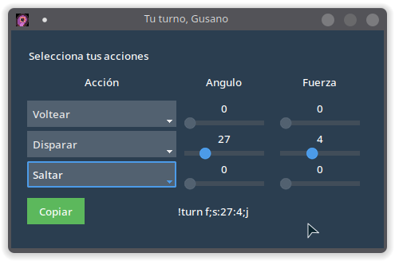

# Tu Turno, Gusano

Tu turno, Gusano (nombre temporal), es una pequeña aplicación que genera un comando para Twitch para jugar a un juego para Twitch y que actualmente está en desarrollo.

Para la interfaz se está usando [ttkbootstrap/](https://github.com/israel-dryer/ttkbootstrap/), una serie de temas para Tcl/Tk supervitaminados que mejoran el diseño

El código está bajo licencia MIT y el icono usado forma parte del pack [Tiny Creatures](https://opengameart.org/content/tiny-creatures) y está bajo licencia [CC0 1.0 Universal](https://creativecommons.org/publicdomain/zero/1.0/legalcode.es) y creado por [Clint Bellager](https://opengameart.org/users/clint-bellanger)

## Como usar:

### Windows y Mac OS

en la página de [releases](https://github.com/son-link/tu_turno_gusano/releases) tenéis los ejecutables para su descarga. Es bajar y listo.

> El ejecutable para Mac OS de momento no esta disponible para ordenadores con procesadores **M1** y **M2**

### Linux:

Por el momento no hay disponibles ejecutables, por lo que para usarlo hay que seguir los mismos pasos que para usar directamente el código

### Código

Para ejecutar desde el código o instalarlo en el sistema hay que seguir estos pasos:

* Descargar el código o clonar este repositorio. También puedes bajarte el código de la última versión estable desde la página de releases
* Crear un entorno virtual. No es obligatorio, pero es lo recomendado.
Para ello, una vez descargado el código, abre una terminal y muévete a la carpeta con el código y ejecuta `python3 -m venv .venv`.
Por último, ejecuta `source .venv/bin/activate` para activar el entorno virtual

* Ejecuta el comando `pip3 install .`
Esto instalará tanto el programa como las dependencias

* Una vez instalado ejecuta `turno-gusano` y ya podrás usarlo.

Para facilitar su uso, copia el archivo turno-gusano.sh a alguna carpeta que este dentro de **\$PATH** (o cópialo, por ejemplo, a tu **\$HOME**) y edita la línea indicada. El script realiza el proceso de moverse a la carpeta, activar el entorno virtual y ejecutar el programa.

> Nota: Si pusiste otro nombre a la carpeta donde se almacena el entorno virtual, que en el ejemplo es *.venv*, deberás de editar la linea correspondiente en el script
