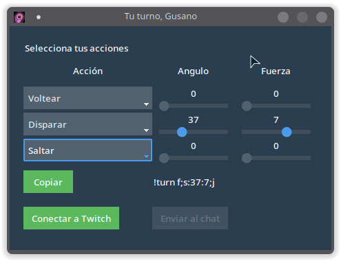

# Tu Turno, Gusano

Tu turno, Gusano (nombre temporal), es una pequeña aplicación que genera un comando para Twitch para jugar a un juego para Twitch y que actualmente está en desarrollo.

Para la interfaz se está usando [ttkbootstrap/](https://github.com/israel-dryer/ttkbootstrap/), una serie de temas para Tcl/Tk supervitaminados que mejoran el diseño

El código está bajo licencia MIT y el icono usado forma parte del pack [Tiny Creatures](https://opengameart.org/content/tiny-creatures) y está bajo licencia [CC0 1.0 Universal](https://creativecommons.org/publicdomain/zero/1.0/legalcode.es) y creado por [Clint Bellager](https://opengameart.org/users/clint-bellanger)